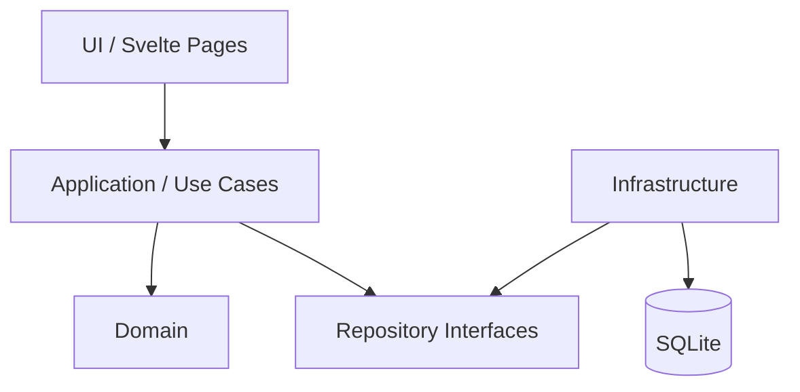

# Personal Finance Manager

Aplicación personal para administrar ingresos, gastos recurrentes, tarjetas de crédito, cuentas por cobrar, fondos apartados y distribución inteligente del dinero disponible.

El objetivo principal de la aplicación es responder una pregunta sencilla:

> **Tengo una cantidad de dinero disponible. ¿A dónde debería dirigirla primero?**

La aplicación no busca únicamente registrar gastos. Su propósito es ayudar a tomar decisiones financieras considerando prioridades, fechas de pago, obligaciones, fondos reservados y deudas.

---

## Ejecutar localmente

```bash
pnpm install
cp .env.example .env
pnpm db:migrate
pnpm dev
```

La aplicación usa SQLite mediante `DATABASE_URL`. Para desarrollo local, `.env.example` apunta a `local.db`.

Comandos útiles:

```bash
pnpm check
pnpm build
pnpm db:generate
pnpm db:migrate
```

---

## Objetivo

Construir una aplicación simple, mantenible y extensible que permita:

- Registrar ingresos.
- Registrar gastos recurrentes.
- Registrar tarjetas de crédito y sus fechas de corte.
- Registrar pagos para no generar intereses.
- Registrar compras a meses sin intereses.
- Registrar dinero que otras personas deben.
- Registrar compromisos futuros.
- Crear fondos o apartados.
- Calcular cuánto dinero está realmente disponible.
- Distribuir una cantidad de dinero según prioridades.
- Evitar considerar el crédito disponible como ingreso.
- Evitar gastar dinero que ya está comprometido.
- Mantener una visión clara de deuda respaldada y deuda no respaldada.

---

# Problema que resuelve

Un saldo bancario alto no necesariamente significa que todo ese dinero esté disponible.

Ejemplo:

```text
Saldo bancario:              $10,000
Dinero comprometido:          $7,200
-------------------------------------
Dinero realmente disponible:  $2,800
```

La aplicación debe distinguir entre:

- Dinero disponible.
- Dinero comprometido.
- Dinero reservado.
- Dinero por cobrar.
- Deuda exigible.
- Deuda diferida.
- Dinero libre para gastar.

---

# Stack tecnológico

## Frontend y backend

- [SvelteKit](https://svelte.dev/docs/kit)
- TypeScript
- Tailwind CSS

## Persistencia

- SQLite
- Drizzle ORM

## Validación

- Zod

## Administrador de paquetes

- pnpm

---

# Arquitectura

El proyecto debe mantenerse como una aplicación monolítica modular.

No se requieren microservicios, colas, Redis ni infraestructura distribuida para el MVP.



La lógica financiera debe vivir fuera de los componentes visuales.

Los componentes no deben decidir cómo distribuir dinero ni calcular prioridades.

---

# Módulos principales

## 1. Dashboard

Es la pantalla principal de la aplicación.

Debe permitir ingresar una cantidad disponible:

```text
Monto a distribuir

$6,500.00
```

La aplicación calcula automáticamente a dónde dirigir el dinero.

Ejemplo:

| Prioridad | Destino | Necesario | Asignar | Restante |
|---:|---|---:|---:|---:|
| 1 | Alimentación | $1,500 | $1,500 | $5,000 |
| 2 | Transporte | $220 | $220 | $4,780 |
| 3 | Compromiso próximo | $500 | $500 | $4,280 |
| 4 | Tarjeta próxima a vencer | $1,300 | $1,300 | $2,980 |
| 5 | Fondo de emergencia | $500 | $500 | $2,480 |
| 6 | Otra deuda | $2,480 | $2,480 | $0 |

El Dashboard debe mostrar al menos:

- Dinero disponible.
- Dinero comprometido.
- Dinero realmente libre.
- Total de deuda.
- Total de deuda exigible.
- Fondos reservados.
- Cuentas por cobrar.
- Próximas obligaciones.
- Distribución sugerida.

---

# 2. Gastos recurrentes

Permite registrar obligaciones periódicas.

Ejemplos:

- Agua.
- Electricidad.
- Internet.
- Transporte.
- Gimnasio.
- Suscripciones.
- Alimentación.
- Otros gastos del hogar.

Modelo aproximado:

```ts
export type ExpenseFrequency =
  | "one_time"
  | "daily"
  | "weekly"
  | "semimonthly"
  | "monthly"
  | "yearly"
  | "custom";

export interface RecurringExpense {
  id: string;
  name: string;
  category: string;
  amount: number;
  amountKind: "fixed" | "estimated";
  frequency: ExpenseFrequency;
  customIntervalCount?: number;
  customIntervalUnit?: "days" | "weeks" | "months" | "years";
  priority: number;
  active: boolean;
}
```

---

# 3. Tarjetas de crédito

Cada tarjeta debe mantener información independiente.

Ejemplo:

```text
BBVA Azul

Saldo actual:
$12,132.43

Día de corte:
14

Fecha límite:
3

Pago para no generar intereses:
$8,125.93

Mensualidad MSI:
$1,643.00
```

Modelo aproximado:

```ts
export interface CreditCard {
  id: string;
  name: string;
  currentBalance: number;
  creditLimit?: number;

  statementDay: number;
  paymentDueDay: number;

  paymentToAvoidInterest: number;
  minimumPayment: number;

  active: boolean;
}
```

---

# Compras a meses sin intereses

Las compras a MSI deben almacenarse de forma independiente al saldo regular.

```ts
export interface InstallmentPurchase {
  id: string;
  creditCardId: string;

  description: string;

  originalAmount: number;
  remainingAmount: number;

  monthlyPayment: number;

  totalInstallments: number;
  currentInstallment: number;

  interestRate: number;
}
```

Una tarjeta puede tener saldo pendiente sin que todo ese saldo sea exigible durante el periodo actual.

Por ello se debe distinguir entre:

```text
Saldo total
Pago requerido
Saldo pendiente a MSI
```

---

# 4. Cuentas por cobrar

Permite registrar dinero prestado a otras personas.

Ejemplo:

```text
Préstamo

Monto original:
$2,897.37

Cobrado:
$0

Pendiente:
$2,897.37
```

Modelo:

```ts
export interface Receivable {
  id: string;

  description: string;
  person?: string;

  originalAmount: number;
  receivedAmount: number;

  expectedDate?: Date;

  status: "pending" | "partial" | "paid";
}
```

## Regla importante

El dinero pendiente de cobro:

> **No debe considerarse dinero disponible hasta que realmente sea recibido.**

Cuando se registra un pago recibido, la aplicación puede ofrecer:

```text
Recibiste $2,897.37

¿Deseas distribuir este dinero?
```

---

# 5. Fondos / apartados

Los fondos representan dinero reservado para un propósito específico.

Ejemplos:

- Fondo para luz.
- Fondo de emergencia.
- Fondo para viaje.
- Fondo para tarjeta.
- Fondo para compras futuras.

Modelo:

```ts
export interface Fund {
  id: string;

  name: string;

  targetAmount?: number;
  currentAmount: number;

  targetDate?: Date;

  priority: number;
  active: boolean;
}
```

Ejemplo:

```text
Fondo electricidad

Objetivo:
$3,000

Apartado:
$1,500

Falta:
$1,500
```

---

# 6. Compromisos futuros

Son obligaciones que todavía no se han pagado pero que tienen fecha conocida.

Ejemplos:

- Viajes.
- Eventos.
- Compras comprometidas.
- Pagos anuales.
- Reparaciones.

```ts
export interface Commitment {
  id: string;

  name: string;

  amount: number;
  reservedAmount: number;

  dueDate: Date;

  priority: number;

  status:
    | "pending"
    | "reserved"
    | "paid"
    | "cancelled";
}
```

---

# Allocation Engine

El motor de distribución es la parte principal del sistema.

Debe recibir:

```ts
allocateMoney({
  amount,
  obligations,
  funds,
  debts,
  rules
});
```

y devolver:

```ts
export interface AllocationResult {
  initialAmount: number;

  allocations: Allocation[];

  remainingAmount: number;
}
```

---

## Allocation

```ts
export interface Allocation {
  destinationId: string;
  destinationType:
    | "expense"
    | "credit-card"
    | "fund"
    | "commitment"
    | "saving";

  name: string;

  requiredAmount: number;
  allocatedAmount: number;

  priority: number;

  status:
    | "covered"
    | "partial"
    | "unfunded";
}
```

---

# Estrategia de distribución

No se debe utilizar únicamente una distribución porcentual.

La aplicación debe utilizar un sistema híbrido:

1. Prioridades obligatorias.
2. Fechas límite.
3. Gastos esenciales.
4. Compromisos.
5. Fondos mínimos.
6. Deudas.
7. Ahorro.
8. Gastos opcionales.

Ejemplo:

```text
1. Alimentación
2. Transporte
3. Pago que vence antes del siguiente ingreso
4. Compromisos previamente adquiridos
5. Fondo de emergencia mínimo
6. Deuda
7. Ahorro
8. Gastos personales
```

Después de cubrir las obligaciones prioritarias, el remanente puede utilizar reglas porcentuales.

---

# Algoritmo inicial

```ts
export function allocateMoney(
  availableMoney: number,
  obligations: Obligation[]
): AllocationResult {
  let remainingAmount = availableMoney;

  const allocations: Allocation[] = [];

  const sortedObligations = obligations
    .filter((obligation) => obligation.active)
    .sort((a, b) => a.priority - b.priority);

  for (const obligation of sortedObligations) {
    if (remainingAmount <= 0) {
      allocations.push({
        destinationId: obligation.id,
        destinationType: obligation.type,
        name: obligation.name,
        requiredAmount: obligation.requiredAmount,
        allocatedAmount: 0,
        priority: obligation.priority,
        status: "unfunded"
      });

      continue;
    }

    const allocatedAmount = Math.min(
      obligation.requiredAmount,
      remainingAmount
    );

    remainingAmount -= allocatedAmount;

    allocations.push({
      destinationId: obligation.id,
      destinationType: obligation.type,
      name: obligation.name,
      requiredAmount: obligation.requiredAmount,
      allocatedAmount,
      priority: obligation.priority,
      status:
        allocatedAmount >= obligation.requiredAmount
          ? "covered"
          : "partial"
    });
  }

  return {
    initialAmount: availableMoney,
    allocations,
    remainingAmount
  };
}
```

Este algoritmo es únicamente la primera versión.

Posteriormente deberá considerar:

- Fecha de vencimiento.
- Fecha del siguiente ingreso.
- Monto ya reservado.
- Pago mínimo.
- Pago para no generar intereses.
- Categoría.
- Prioridad configurable.
- MSI.
- Saldo disponible en fondos.

---

# Conceptos financieros de la aplicación

## Dinero disponible

Dinero que actualmente existe y puede ser utilizado.

```text
availableCash
```

---

## Dinero comprometido

Dinero reservado para obligaciones existentes.

```text
committedMoney
```

---

## Dinero realmente libre

```text
freeMoney =
  availableCash
  - committedMoney
```

Este debe ser uno de los indicadores principales del Dashboard.

---

# Deuda respaldada

Una deuda está respaldada cuando ya existe dinero reservado para cubrirla.

Ejemplo:

```text
Saldo tarjeta:
$2,000

Fondo reservado para tarjeta:
$2,000

Deuda no respaldada:
$0
```

---

# Deuda no respaldada

```text
unbackedDebt =
  debt
  - reservedMoney
  - nonDueInstallments
```

El objetivo de la aplicación no necesariamente es que todas las tarjetas tengan saldo `$0`.

El objetivo es reducir:

```text
deuda no respaldada
```

---

# Reglas de negocio

## RN-01

Una tarjeta de crédito nunca debe considerarse ingreso.

---

## RN-02

Registrar una compra con tarjeta debe consumir presupuesto inmediatamente.

El hecho de que la tarjeta se pague posteriormente no significa que el gasto ocurra en el futuro.

---

## RN-03

El dinero de una cuenta por cobrar no debe considerarse disponible hasta registrarse como recibido.

---

## RN-04

Los fondos apartados deben descontarse del dinero realmente libre.

---

## RN-05

Una obligación puede recibir una asignación parcial cuando no existe dinero suficiente.

---

## RN-06

Las obligaciones con prioridad superior deben recibir dinero antes que las de menor prioridad.

---

## RN-07

Los gastos opcionales pueden quedar sin asignación cuando existen obligaciones prioritarias pendientes.

---

## RN-08

El pago para no generar intereses debe tener prioridad sobre gastos opcionales cuando su fecha límite ocurre antes del próximo ingreso esperado.

---

## RN-09

Las mensualidades de MSI deben diferenciarse del saldo no exigible.

---

## RN-10

El sistema debe permitir modificar manualmente prioridades y montos sugeridos.

---

# MVP

El MVP debe incluir únicamente:

- [ ] Dashboard.
- [ ] Registrar gastos recurrentes.
- [ ] Editar gastos recurrentes.
- [ ] Registrar tarjetas.
- [ ] Editar tarjetas.
- [ ] Registrar compras a MSI.
- [ ] Registrar cuentas por cobrar.
- [ ] Registrar pagos de cuentas por cobrar.
- [ ] Registrar fondos.
- [ ] Registrar compromisos.
- [ ] Registrar ingresos.
- [ ] Distribuir una cantidad disponible.
- [ ] Mostrar deuda respaldada.
- [ ] Mostrar deuda no respaldada.
- [ ] Mostrar dinero realmente libre.

---

# Fuera del MVP

No implementar inicialmente:

- Integraciones bancarias.
- Scraping bancario.
- OCR de estados de cuenta.
- Inteligencia artificial.
- Microservicios.
- Redis.
- Colas.
- Notificaciones push.
- Multiusuario.
- Sincronización bancaria automática.
- Importación automática de movimientos.
- Aplicación móvil nativa.

Estas funcionalidades pueden considerarse después de validar que el motor de distribución realmente sea útil.

---

# Estructura sugerida

```text
src/
├── lib/
│   ├── modules/
│   │   ├── allocation/
│   │   │   ├── domain/
│   │   │   ├── application/
│   │   │   └── infrastructure/
│   │   │
│   │   ├── credit-cards/
│   │   ├── expenses/
│   │   ├── funds/
│   │   ├── income/
│   │   ├── commitments/
│   │   └── receivables/
│   │
│   ├── server/
│   │   └── db/
│   │       ├── schema/
│   │       ├── migrations/
│   │       └── index.ts
│   │
│   ├── components/
│   └── utils/
│
└── routes/
    ├── +page.svelte
    ├── cards/
    ├── expenses/
    ├── funds/
    └── receivables/
```

---

# Principios técnicos

El proyecto debe priorizar:

- Clean Code.
- SOLID.
- Separación de responsabilidades.
- Tipado estricto.
- Componentes pequeños.
- Lógica de negocio independiente de Svelte.
- Validaciones centralizadas.
- No duplicar reglas financieras.
- Repositories desacoplados de los casos de uso.
- Tests unitarios para el Allocation Engine.

---

# Testing

La prioridad de pruebas debe estar en el motor de distribución.

Ejemplo:

```ts
describe("allocateMoney", () => {
  it("should prioritize essential obligations", () => {
    // ...
  });

  it("should partially fund an obligation when money is insufficient", () => {
    // ...
  });

  it("should never allocate more money than available", () => {
    // ...
  });

  it("should leave optional expenses unfunded when higher priorities exist", () => {
    // ...
  });
});
```

---

# Roadmap

## Fase 1 — Base

- Configuración de SvelteKit.
- SQLite.
- Drizzle.
- Migraciones.
- Layout principal.

## Fase 2 — Configuración financiera

- Gastos recurrentes.
- Tarjetas.
- Cuentas por cobrar.
- Fondos.
- Compromisos.

## Fase 3 — Allocation Engine

- Prioridades.
- Distribución de dinero.
- Asignaciones parciales.
- Dinero restante.

## Fase 4 — Dashboard

- Dinero disponible.
- Dinero comprometido.
- Dinero libre.
- Deuda.
- Fondos.
- Distribución sugerida.

## Fase 5 — Historial

- Ingresos.
- Pagos.
- Movimientos.
- Historial de distribuciones.

## Fase 6 — Mejoras

- Estadísticas.
- Metas.
- Historial mensual.
- Alertas.
- Importación de estados de cuenta.

---

# Estado

Proyecto en fase de diseño.

La primera meta técnica es implementar correctamente:

> **Ingresar una cantidad disponible y obtener una distribución clara, justificable y reproducible de a dónde debe dirigirse ese dinero.**
