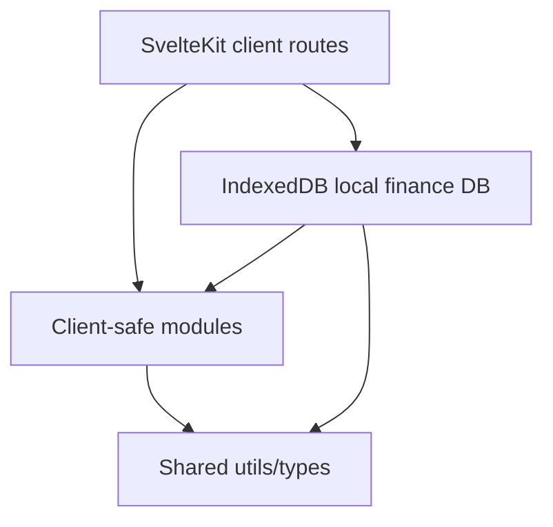

# Architecture

Wallet is a local-first SvelteKit PWA. The installed app runs without a permanent server; financial data is stored in each browser installation through IndexedDB.

The official structure is the one already used by the repository:

```text
src/
|-- lib/
|   |-- local/
|   |   `-- finance-db.ts
|   |-- server/
|   |   |-- db/
|   |   `-- <module>/
|   |       |-- <module>.service.ts
|   |       |-- <module>.repository.ts
|   |       |-- drizzle-<module>.repository.ts
|   |       |-- <module>.errors.ts
|   |       `-- inputs/
|   |-- modules/
|   |   `-- <module>/
|   |       |-- components/
|   |       |-- types/
|   |       |-- utils/
|   |       `-- mappers/
|   |-- shared/
|   |   |-- types/
|   |   `-- utils/
|   `-- components/
`-- routes/
```

## Boundaries

SvelteKit route files are client adapters. They load data from `$lib/local/finance-db`, render reusable module components, and submit forms through the root layout's local form interceptor. Routes needed by the installed app must not depend on `+page.server.ts`, form actions, endpoints, or server-only imports.

`src/lib/local/finance-db.ts` owns the current IndexedDB database, versioned backup format, page read models, and local write use cases. Movement writes apply balance deltas before committing the snapshot so failed writes do not leave partial balances.

Legacy server services and Drizzle repositories remain as reference code for the SQLite-era rules and for future one-time export tooling, but they are not part of the installed app runtime.

Services own business rules, use cases, validation that protects the domain, coordination between repositories, and transaction boundaries when needed. Services receive explicit input objects, not SvelteKit framework objects.

Repositories own database access. They read, create, update, delete, and encapsulate Drizzle queries. They do not decide permissions or financial rules.

Client-safe modules under `src/lib/modules` own Svelte components, UI types, shared response types, and pure presentation/domain helpers that can run in the browser.

Shared utilities under `src/lib/shared` are framework-safe, client-safe helpers reused across modules.

Runtime database infrastructure for the installed app belongs in `src/lib/local`. SQLite/Drizzle infrastructure belongs in `src/lib/server/db` only for development, reference, and migration/export tooling.

## Local Runtime

The local runtime uses the IndexedDB database `wallet-local-finance`, version `1`.

Stores:

- `banks`
- `categories`
- `colorPalettes`
- `accounts`
- `movements`
- `recurringExpenses`
- `recurringIncomes`
- `financialGoals`
- `loans`
- `installmentPurchases`
- `creditCardStatements`

Each installation is independent. Installing the app on two iPhones creates two separate databases unless the user imports the same backup into both. There is no pending-sync state and no backend source of truth.

Initial local data is intentionally minimal: the default color palette set and the personal cash account. The default palettes are re-seeded when missing, including after restoring a backup that does not contain theme data. Existing SQLite data can be moved with a versioned JSON backup/import file; starting empty is also valid.

## Server Dependency Inventory

The following routes previously loaded from `+page.server.ts` and server services. They now load from the local IndexedDB read model:

- `/`: dashboard summary.
- `/cuentas`: accounts and banks.
- `/cuentas/[id]`: credit account detail, statements, and installment purchases.
- `/movimientos`: movements, account cards, categories, recurring expenses, and recurring incomes.
- `/recurrentes`: recurring expenses and incomes.
- `/metas`: financial goals and planning periods.
- `/prestamos`: loan summaries and cards.
- `/prestamos/[id]`: loan detail and linked movements.
- `/planificacion`: next-income planning view.
- `/settings`: banks, categories, color palettes, profile, and backup/restore.

The root layout installs a submit interceptor for local forms whose action starts with `?/`. Those submissions call local IndexedDB use cases and then invalidate client loads.

## Static Build And Offline Strategy

The app uses `@sveltejs/adapter-static` with `fallback: 'index.html'`, `ssr = false`, and `prerender = true`. Navigation is an SPA shell, so internal route changes do not need server-rendered HTML.

The service worker caches SvelteKit build assets, the app shell, manifest, offline page, and icons. For navigations while the origin is unavailable, it serves `index.html` before falling back to `offline.html`; this allows the installed app to open full routes, not only a generic offline page.

Temporary HTTPS is still required for iPhone installation and service worker registration. After install and cache preparation, the origin can be unavailable and the local database remains the financial source of truth.

## Current Exception

Server modules currently live directly under `src/lib/server/<module>` instead of `src/lib/server/modules/<module>`. This is the project convention for the current codebase. New server feature modules should follow the same layout unless the whole tree is intentionally migrated in one coordinated refactor.

## Dependency Direction



`src/lib/modules` must not import from `src/lib/server`.

## Naming

- Services: `<module>.service.ts`
- Repository contracts: `<module>.repository.ts`
- Drizzle repositories: `drizzle-<module>.repository.ts`
- Errors: `<module>.errors.ts`
- Inputs: `inputs/<action>.input.ts`
- Component folders: kebab-case folder plus PascalCase `.svelte` component and local `props.ts`

## Validation

Use `pnpm check` as the baseline verification for architecture changes. Local-first changes must also run `pnpm test`.
