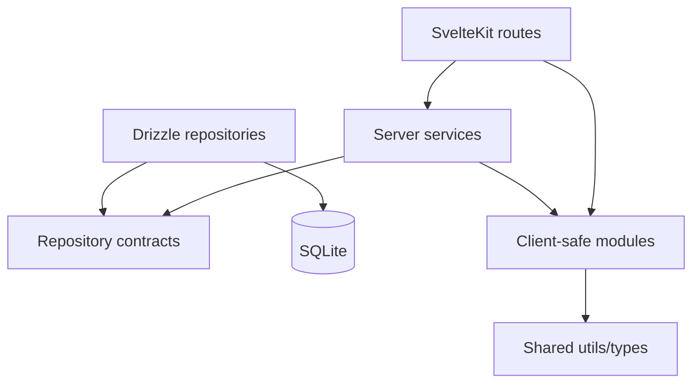

# Architecture

Wallet is a modular SvelteKit monolith. The official structure is the one already used by the repository:

```text
src/
|-- lib/
|   |-- server/
|   |   |-- db/
|   |   `-- <module>/
|   |       |-- <module>.service.ts
|   |       |-- <module>.repository.ts
|   |       |-- drizzle-<module>.repository.ts
|   |       |-- <module>.errors.ts
|   |       `-- inputs/
|   |-- modules/
|   |   `-- <module>/
|   |       |-- components/
|   |       |-- types/
|   |       |-- utils/
|   |       `-- mappers/
|   |-- shared/
|   |   |-- types/
|   |   `-- utils/
|   `-- components/
`-- routes/
```

## Boundaries

SvelteKit route files are adapters. They read request data, validate UI-level fields, call services, and return page/action results.

Services own business rules, use cases, validation that protects the domain, coordination between repositories, and transaction boundaries when needed. Services receive explicit input objects, not SvelteKit framework objects.

Repositories own database access. They read, create, update, delete, and encapsulate Drizzle queries. They do not decide permissions or financial rules.

Client-safe modules under `src/lib/modules` own Svelte components, UI types, shared response types, and pure presentation/domain helpers that can run in the browser.

Shared utilities under `src/lib/shared` are framework-safe, client-safe helpers reused across modules.

Database infrastructure belongs in `src/lib/server/db`.

## Current Exception

Server modules currently live directly under `src/lib/server/<module>` instead of `src/lib/server/modules/<module>`. This is the project convention for the current codebase. New server feature modules should follow the same layout unless the whole tree is intentionally migrated in one coordinated refactor.

## Dependency Direction



`src/lib/modules` must not import from `src/lib/server`.

## Naming

- Services: `<module>.service.ts`
- Repository contracts: `<module>.repository.ts`
- Drizzle repositories: `drizzle-<module>.repository.ts`
- Errors: `<module>.errors.ts`
- Inputs: `inputs/<action>.input.ts`
- Component folders: kebab-case folder plus PascalCase `.svelte` component and local `props.ts`

## Validation

Use `pnpm check` as the baseline verification for architecture changes.
